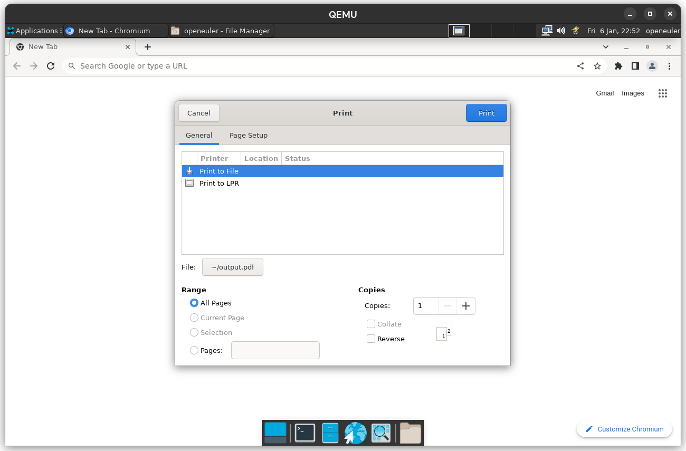

# 使用系统对话框打印标签页

## 操作步骤

选择要打印的标签页，按 Ctrl+P 打开打印对话框，点击 More settings 中的 Print using system dialog... (Ctrl+Shift+P) 选项

## 预期结果

系统打印对话框成功打开，使用系统打印对话框打印标签页成功

## 实际结果

系统打印对话框成功打开，使用系统打印对话框打印标签页成功

